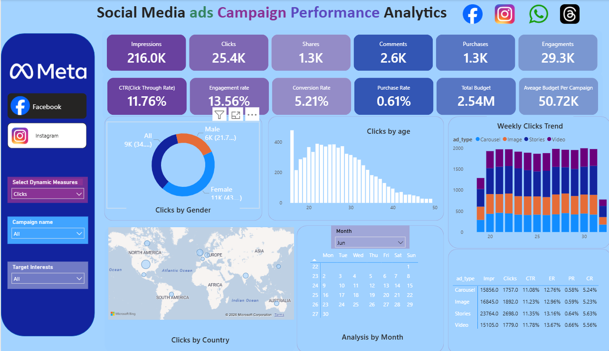
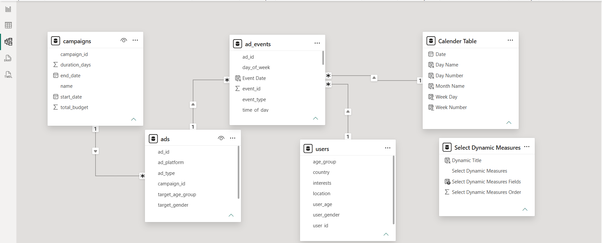

# 📊 Social Media Ad Campaign Performance Analytics Dashboard



> An end-to-end **Power BI** analytics solution for tracking Meta (Facebook & Instagram) ad campaign performance — from raw event data to actionable marketing KPIs.

🔗 **[View Live Dashboard](https://app.powerbi.com/groups/me/reports/a598e58c-a636-4eaa-9510-ae8a25e6dddb/9777a38c9b4384394b2b?experience=power-bi)**

---

## 📌 Project Overview

Marketing teams running paid campaigns across Meta platforms often lack a unified view of performance. This project bridges that gap by building a self-service Power BI dashboard that consolidates campaign, ad, event, and user data into a single analytics layer — enabling data-driven decisions on budget allocation, audience targeting, and creative strategy.

---

## 🗂️ Repository Structure

```
Social_Media_Ad_Campaign_Dashboard/
│
├── Datasets/                        # Raw CSV data files
│   ├── campaigns.csv
│   ├── ads.csv
│   ├── ad_events.csv
│   └── users.csv
│
├── Resources/                       # Screenshots and visual assets
│   ├── Social_media_campaign_dashboard.png
│   └── Data_Modeling.png
│
├── power_bi_file/                   # Power BI project file
│   └── social_media_campaign.pbix
│
└── README.md
```

---

## 🗃️ Data Model

A **Star Schema** was designed with 5 core tables for optimal query performance and DAX calculation accuracy.



| Table | Type | Description |
|---|---|---|
| `campaigns` | Dimension | Campaign metadata — name, budget, start/end dates, duration |
| `ads` | Dimension | Ad-level details — platform, type, target age group & gender |
| `ad_events` | Fact | Event-level grain — impressions, clicks, shares, purchases, comments |
| `users` | Dimension | User profile — age, gender, country, interests |
| `Calendar Table` | Date Dimension | Time intelligence — Day, Week, Month, Day Name, Week Number |

**Relationships:**
- `campaigns` → `ads` (1:*)
- `ads` → `ad_events` (1:*)
- `users` → `ad_events` (1:*)
- `Calendar Table` → `ad_events` (1:*) via Event Date

---

## 📐 DAX Measures

```dax
-- Click Through Rate
CTR = DIVIDE([Total Clicks], [Total Impressions])

-- Engagement Rate
Engagement Rate = DIVIDE([Total Clicks] + [Total Shares] + [Total Comments], [Total Impressions])

-- Conversion Rate
Conversion Rate = DIVIDE([Total Purchases], [Total Clicks])

-- Purchase Rate
Purchase Rate = DIVIDE([Total Purchases], [Total Impressions])

-- Average Budget Per Campaign
Avg Budget Per Campaign = DIVIDE([Total Budget], DISTINCTCOUNT(campaigns[campaign_id]))

-- Dynamic Measures (Field Parameter)
-- Allows switching between Impressions, Clicks, Shares, Comments, Purchases via slicer
```

---

## 📊 Dashboard Features

### KPI Summary Row
| Metric | Value |
|---|---|
| Impressions | 216.0K |
| Clicks | 25.4K |
| Shares | 1.3K |
| Comments | 2.6K |
| Purchases | 1.3K |
| Engagements | 29.3K |
| CTR | 11.76% |
| Engagement Rate | 13.56% |
| Conversion Rate | 5.21% |
| Purchase Rate | 0.61% |
| Total Budget | 2.54M |
| Avg Budget/Campaign | 50.72K |

### Visuals Included
- 🍩 **Clicks by Gender** — Donut chart with All / Male / Female breakdown
- 📊 **Clicks by Age** — Histogram showing engagement across age groups
- 📅 **Weekly Clicks Trend** — Stacked bar by ad type (Carousel, Image, Stories, Video)
- 🗺️ **Clicks by Country** — Bing Maps geographic distribution
- 🗓️ **Analysis by Month** — Calendar matrix with day-level drill-down
- 📋 **Ad Type Performance Table** — CTR, ER, PR, CR by creative format
- 🎛️ **Dynamic Measure Slicer** — Switch any chart metric with one click
- 🔽 **Campaign Name & Target Interests Filters** — Slice data by campaign or audience interest

---

## 💡 Key Insights

1. **Stories ads outperform** all other formats on Conversion Rate (5.63%) — highest ROI creative format
2. **Female audience** generates nearly 2x clicks vs. male — significant targeting signal
3. **Ages 25–35** are the peak converting segment across campaigns
4. **Carousel ads** have the lowest Purchase Rate (0.58%) — candidate for creative refresh or budget reallocation
5. **Weeks 25–26** show consistent engagement spikes — ideal windows for campaign scheduling

---

## 🛠️ Tools & Technologies

- **Power BI Desktop** — Dashboard development & publishing
- **DAX** — KPI measures, time intelligence, dynamic field parameters
- **Power Query (M)** — Data transformation and loading
- **Star Schema Design** — Dimensional modeling for performance
- **Bing Maps Visual** — Geographic analysis
- **Field Parameters** — Dynamic metric selection across visuals

---

## 🚀 How to Use

1. Clone this repository
   ```bash
   git clone https://github.com/ChanakyaSreeHarshaG/Social_Media_Ad_Campaign_Dashboard.git
   ```
2. Open `power_bi_file/social_media_campaign.pbix` in **Power BI Desktop**
3. If prompted, update data source paths to the local `Datasets/` folder
4. Explore the dashboard — use slicers to filter by campaign, platform, or interest group

---

## 📬 Connect

**Chanakya Sree Harsha G**
- 🔗 [LinkedIn](https://www.linkedin.com/in/chanakya-sree-harsha-g)
- 💻 [GitHub](https://github.com/ChanakyaSreeHarshaG)
- 📊 [Live Dashboard](https://app.powerbi.com/groups/me/reports/a598e58c-a636-4eaa-9510-ae8a25e6dddb/9777a38c9b4384394b2b?experience=power-bi)

---

*If you found this useful, please ⭐ star the repo and feel free to raise issues or suggestions!*
